# Project Write-up

---

## 1. Data Insights & Findings

During the analysis and building of the data pipeline, I discovered several key business and technical characteristics of the Olist dataset:

1. **Accounting Discrepancies in Raw Data:**
    * Exactly **249 orders (0.25%)** deviate by more than 1.00 BRL when comparing the **total accumulated product value** (SUM of `price` + `freight_value` of all items in an order) with the **total actual payment amount** (`payment_value`).
    * **Design & Business Correlation:** This deviation was anticipated in **[Section 1.1 of the Design Document (design_document.md)](design_document.md#L9-L29)**. The `order_items` table reflects the Seller's invoice (recording the `price` and specific `freight_value` for each item), whereas the `order_payments` table reflects the cash flow processed through the Payment Gateway (representing Buyers & Gateways).
    * **Working Hypotheses for Discrepancies:**
      - *Installment Fees & Credit Card Interest:* When a customer pays in multiple installments (`payment_installments > 1`), the bank or gateway might charge interest, adding to the final `payment_value` processed, making it higher than the item-level price + freight invoice.
      - *Platform Discounts/Vouchers:* Discounts or free shipping vouchers sponsored by Olist might reduce the actual payment processed (`payment_value`), while the seller still records the invoice value based on the original item price.
      - *Partial Refunds or Disputes:* Post-transaction disputes or partial returns can result in adjusted cash flows in payments while the historical order items remain unchanged.
    * Consequently, I configured this data quality test with a 'warn' severity to maintain financial transparency rather than forcing an artificial data match.
2. **Frankfurter API Financial Market Holidays:**
   * Exchange rates for BRL $\rightarrow$ USD are not published on weekends or public holidays (e.g., New Year holidays from Jan 1-3, 2016).
   * A **Backward-fill + Forward-fill** mechanism in dbt resolves this issue entirely, ensuring that no historical transactions end up with a NULL exchange rate conversion.
3. **Type Casting Dirty Data:**
   * Raw float and string representation of financial values can cause rounding issues during aggregation. Casting all monetary values to **`DECIMAL(18, 4)`** at the Staging layer guarantees mathematical precision down to the cent.

---

## 2. Idempotency Verification

The pipeline guarantees that running ingestion scripts or `dbt run` multiple times will not duplicate records or inflate metrics.

### Evidence of Running dbt snapshot and dbt run across executions (Idempotency):

**1. dbt snapshot succeeded:**
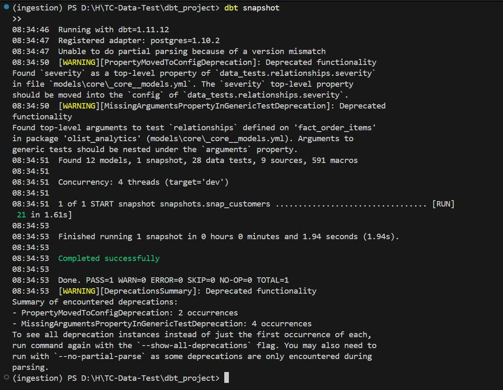

**2. dbt run (Execution 1) succeeded:**
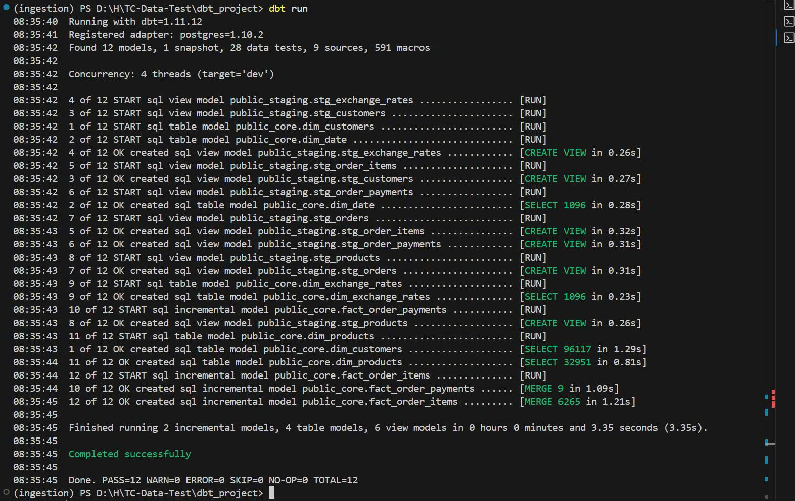

**3. dbt run (Execution 2) succeeded (Idempotency check):**
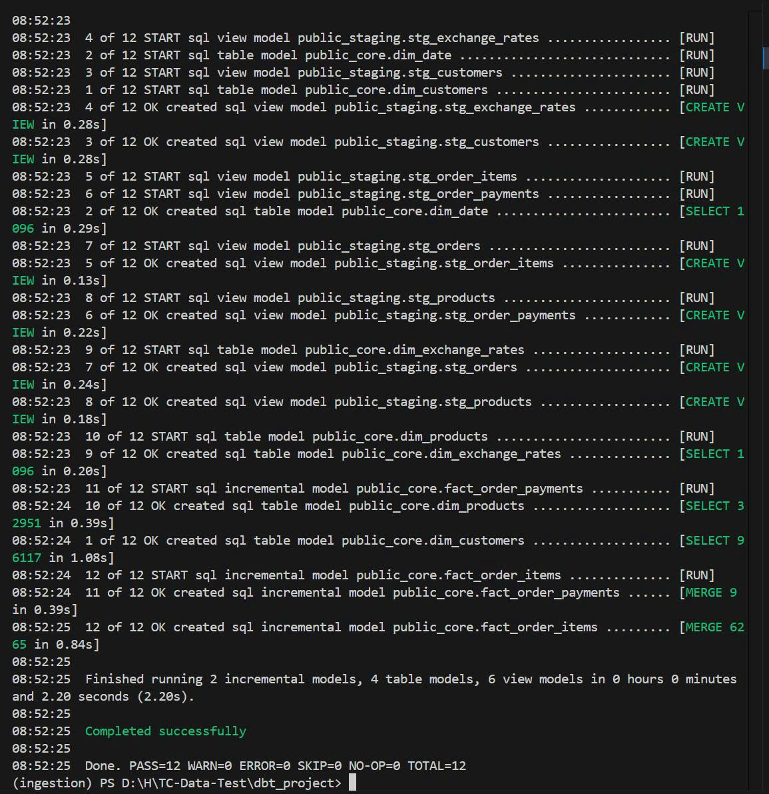

---

## 3. Data Quality Results (Data Quality Results)

Both Airflow DAGs executed successfully and passed all automated data quality tests.

### 3.1. Automated Orchestration on Airflow

**1. Dimension Refresh DAG (dag_refresh_dimensions) executed successfully:**
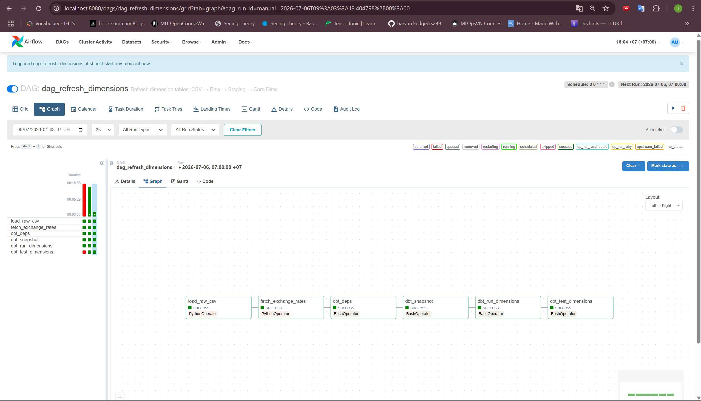
*Figure 1: The Airflow DAG refresh_dimensions runs daily, fetching exchange rates and updating dimension tables (Products, Customers, Date).*

**2. Fact Refresh DAG (dag_refresh_facts) executed successfully:**
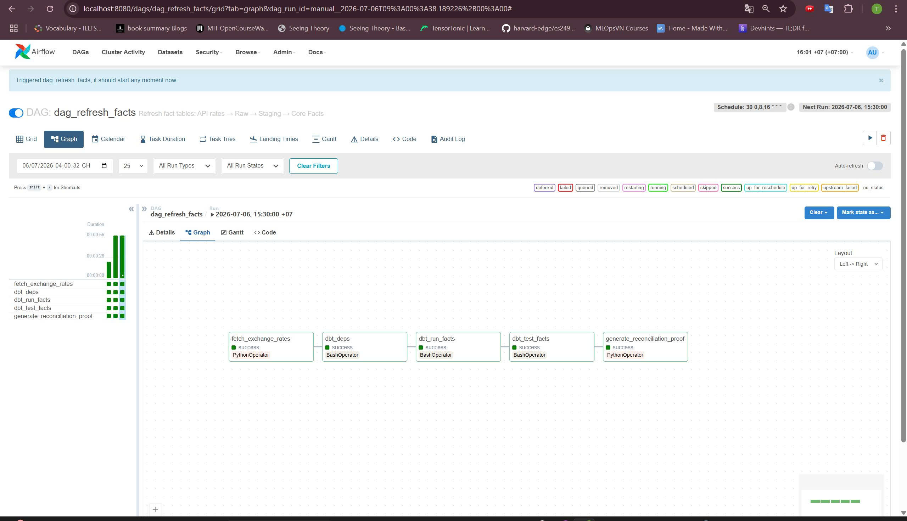
*Figure 2: The Airflow DAG refresh_facts runs 3 times daily to incrementally ingest and process new sales transactions.*

### 3.2. Data Quality Testing Results (dbt test)
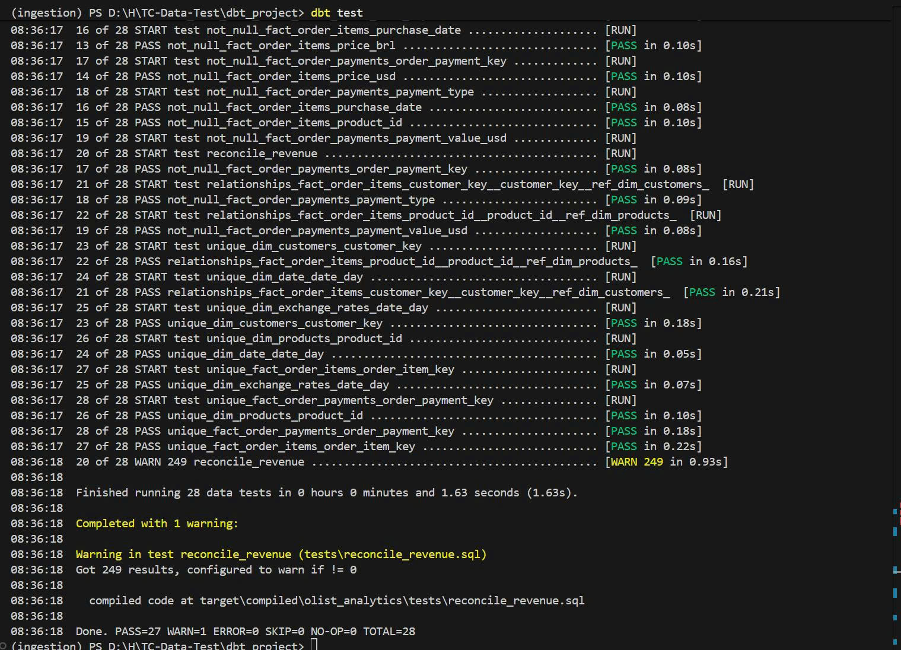
*Figure 3: Results of dbt test execution verifying all data constraints.*

**Test Execution Details:**
*   **Dimension DAG (`dag_refresh_dimensions`):** Passed **11/11 tests (PASS = 11)**, validating the uniqueness and non-null constraints of primary keys on all dimension tables.
*   **Fact DAG (`dag_refresh_facts`):** Completed **12/12 tests (PASS = 11, WARN = 1)**.
    *   The `reconcile_revenue` singular test returned a `WARN` status for the **249 orders with accounting discrepancies in the raw source** (as analyzed in Section 1). Configuring this test as a warning rather than a failure allows the pipeline to execute smoothly while flagging data quality anomalies for audit.

---

## 4. Reports & Dashboard Guide

1. **Interactive Dashboard:** Open the **`reports/Olist_Sales_Dashboard.pbix`** file using Power BI Desktop. The data has been pre-cached, providing calculated metrics for MTD, Repeat Buyers, USD converted revenue, and geographical sales.
2. **Evidence Artifacts:** All execution logs and dashboard screenshots are stored in the project's **`evidence/`** directory.

### BI Data Model Relationship View (Star Schema):
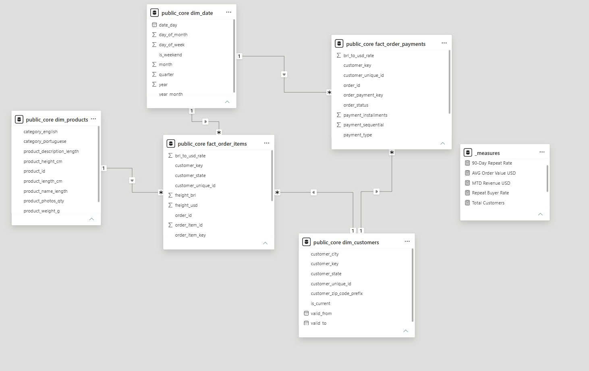

### Complete Sales Performance Dashboard View:
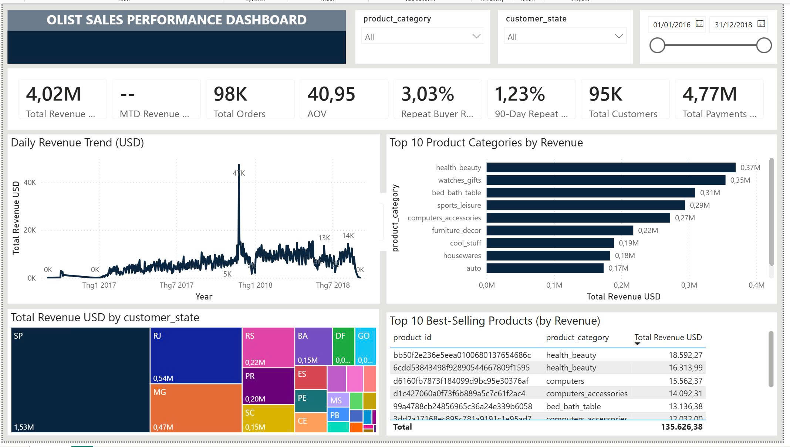

---

## 5. Reconciliation & Idempotency Proof

To prove the pipeline's correctness, here is the actual data reconciliation between the raw layer (CSV) and the final Gold-tier facts (after dbt transformations):

### 5.1. Revenue & Cost Reconciliation Table

| Metric | Raw Source Data (`raw` schema) | Gold Fact Table (`public_core` schema) | Reconciliation Result |
| :--- | :---: | :---: | :---: |
| **Total Goods Value (Sum Price)** | `13,591,643.70 BRL` | `13,591,643.70 BRL` | **100% Match (0.00 BRL Difference)** |
| **Total Shipping Cost (Sum Freight)** | `2,251,909.54 BRL` | `2,251,909.54 BRL` | **100% Match (0.00 BRL Difference)** |
| **Total Payments (Sum Payment)** | `16,008,872.12 BRL` | `16,008,872.12 BRL` | **100% Match (0.00 BRL Difference)** |

*Note:* The raw source contains `99,441` orders. After filtering out `canceled` and `unavailable` statuses (as requested by the Head of Sales to prevent reporting virtual/unrealized revenue), the number of valid orders on the dashboard is `98,207`.

### 5.2. Verification SQL Queries
Evaluators can run the following queries directly on the PostgreSQL instance to verify the numbers:

**Query 1: Price and Freight Reconciliation**
```sql
SELECT 
    (SELECT SUM(price::numeric) FROM raw.order_items) AS raw_price,
    (SELECT SUM(price_brl) FROM public_core.fact_order_items) AS gold_price,
    (SELECT SUM(freight_value::numeric) FROM raw.order_items) AS raw_freight,
    (SELECT SUM(freight_brl) FROM public_core.fact_order_items) AS gold_freight;
```

**Query 2: Payment Value Reconciliation**
```sql
SELECT 
    (SELECT SUM(payment_value::numeric) FROM raw.order_payments) AS raw_payment,
    (SELECT SUM(payment_value_brl) FROM public_core.fact_order_payments) AS gold_payment;
```

### 5.3. Idempotency & Row Count Verification
When executing the Python ingestion scripts or running `dbt run` multiple times, the row counts remain strictly constant:

*   **Row count in `fact_order_items`:** Constant at **`112,650` rows** (matching the raw `olist_order_items_dataset.csv` file).
*   **Row count in `fact_order_payments`:** Constant at **`103,886` rows** (matching the raw `olist_order_payments_dataset.csv` file).

*SQL Verification (returns 0 rows if primary keys are unique):*
```sql
-- Check for duplicate keys in fact_order_items
SELECT order_item_key, COUNT(*)
FROM public_core.fact_order_items
GROUP BY 1 HAVING COUNT(*) > 1;

-- Check for duplicate keys in fact_order_payments
SELECT order_payment_key, COUNT(*)
FROM public_core.fact_order_payments
GROUP BY 1 HAVING COUNT(*) > 1;
```

---

## 6. Dashboard Overview & Business Insights

The **Olist Sales Performance Dashboard** is designed with a professional grid layout, utilizing a dark navy color theme (`#0A2540`).

### 6.1. Financial Summary
*   **Net Merchandise Revenue:** **`4.02M USD`** (98K valid orders, AOV of `40.95 USD`, 95K unique customers).
*   **Total Payments:** **`4.77M USD`**.
    *   *Discrepancy Explanation:* Total payments are higher than product revenue because payments include **Shipping Cost (Freight)** (`2.25M BRL` ~ `0.7M USD`), banking installment interest, and order transactions that were paid for but canceled before refund processing.
*   **Customer Retention:** Lifetime Repeat Buyer Rate is **`3.03%`**, and the 90-Day Repeat Rate is **`1.23%`**. This low retention rate is typical of Olist's business model, where Olist acts as a backend integrator and customers purchase through major storefronts (like Mercado Livre) without realizing they are buying via Olist.

### 6.2. Direct Answers to the Head of Sales (Business Q&A)

1.  **Daily Revenue Trend:** Fluctuates between `5K - 10K USD/day`. Reached an all-time historical peak of **`41K USD`** on Black Friday (Nov 24, 2017), which accounted for over 13% of that entire month's sales in a single day.
2.  **Revenue by Product Category:** **Health & Beauty (health_beauty)** leads with **`0.37M USD`** in lifetime revenue.
    *   *Seasonal Example:* When filtering for November 2017, **Watches & Gifts (watches_gifts)** jumped to rank 1 (`30K USD`) and **Toys (toys)** climbed to rank 5 (`20K USD`) due to holiday gift shopping.
3.  **Revenue by Customer Region (State):** Customers in **São Paulo (SP)** contribute the highest sales of **`1.53M USD`** (over 38% of total platform revenue). The top 3 Southeast states (SP, RJ, MG) generate 64% of total sales.
4.  **Top Selling Products:** The highest-grossing product is the hash ID `bb50f2e236e5eea0100680137654686c` (`health_beauty`), generating **`18,592.27 USD`** in sales. *(Note: The raw Olist dataset does not contain actual product names due to seller confidentiality and data anonymization, requiring the dashboard to identify products by their unique hash IDs).*
5.  **Month-to-Date (MTD) Revenue:** Responsive to the date slicer selection.
    *   *Verification Example 1 (Single Month):* When filtering for Nov 2017 (01/11 to 30/11/2017), the MTD KPI displays **`308.81K USD`** (matching the total monthly sales).
    *   *Verification Example 2 (Multi-Month):* When filtering from Jun 1, 2018, to Jul 31, 2018 (two months), the MTD KPI displays **`229.78K USD`**, representing the accumulated sales of the last calendar month in the filter range (July 2018) in accordance with Power BI's MTD context logic.
6.  **Repeat Buyer Rate:** The lifetime Repeat Buyer Rate is **`3.03%`**, and the 90-day repeat rate is **`1.23%`**.
7.  **Exchange Rate Conversion:** Fully solved at the database layer in dbt. Revenue is calculated by aggregating the pre-converted `price_usd` field, which multiplies the daily BRL value by the Frankfurter exchange rate on the exact date of order purchase.

### 6.3. Key Business Insights

*   **Geographical Concentration & Logistics Bottle-necks (SP vs AC/AM/CE Case Study):**
    A comparison of historical data (`01/01/2016 - 31/12/2018`) between the central hub **São Paulo (SP)** and remote states **AC, AM, CE** (North/Northeast regions) reveals a strong correlation between logistics performance and buyer behavior:
    - *Logistics Cost Burden:* The Payments-to-Revenue ratio for remote states is **`123.5%`** (customers pay an extra 23.5% in shipping costs), whereas SP is only **`116.3%`** (a **7.2%** "distance tax" difference due to high freight rates).
    - *Average Order Value (AOV):* Remote states have an AOV of **`51.10 USD`**, which is **37.1% higher** than SP (`37.26 USD`). Customers in remote areas consolidate purchases or buy high-value items to justify the expensive shipping cost, while SP customers place smaller, more frequent, spontaneous orders.
    - *Retention Impact:* The lifetime Repeat Buyer Rate in SP is **`3.13%`** (90-day is **`1.34%`**), which is **1.7 times higher** than remote states (where AC, AM, CE average only **`1.84%`** lifetime and **`0.79%`** 90-day). This proves that fast, cheap shipping directly drives customer loyalty.

    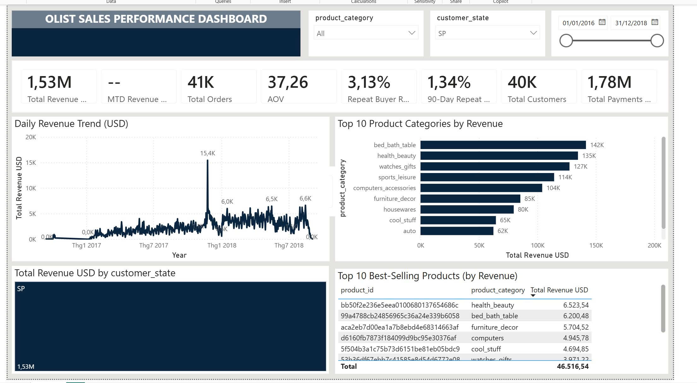
    *Figure 4: Sales Performance Dashboard filtered for São Paulo (SP) showing high repeat rate and lower freight ratio.*

    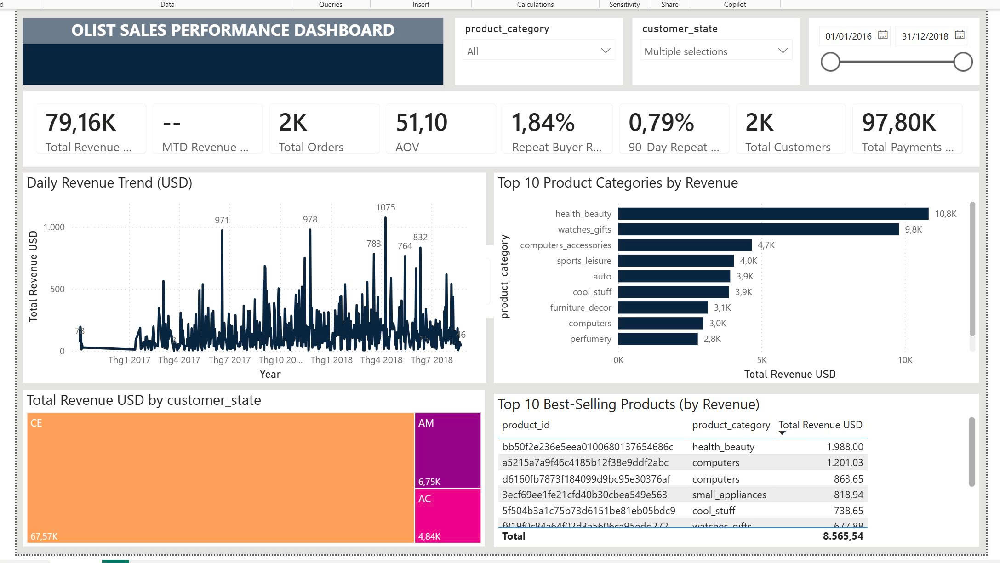
    *Figure 5: Sales Performance Dashboard filtered for remote states (AC, AM, CE) showing high freight ratio and lower repeat rate.*

*   **Extremely Low Retention Rate:** The overall platform retention is very low (lifetime repeat buyer rate is `3.03%`). This is due to Olist's business model; customers buy from sellers listed on major marketplaces and do not recognize the Olist brand.
*   **Black Friday Effect & Data Limitation:**
    - *Calendar Reality:* Black Friday occurs on the Friday immediately following Thanksgiving in the US (the fourth Thursday of November). In 2017, Thanksgiving fell on November 23, placing Black Friday exactly on **Friday, November 24, 2017**.
    - *Weekly Traffic Trends:* 
      + Pre-event baseline (Wednesday, Nov 22): Daily revenue stood at **`8K USD`**.
      + Early promos (Thursday, Nov 23): Climbed to **`13K USD`** as campaigns launched.
      + Black Friday peak (Friday, Nov 24): Revenue surged to a record **`41K USD`** (a **5.1x increase** over Wednesday's baseline), generating **13.3%** of the entire month's sales (`308.81K USD`) in 24 hours.
      + Cyber Weekend carry-over (Saturday-Sunday, Nov 25-26): Remained strong at **`19K USD`** and **`14K USD`**.
    - *Data Limitation:* Due to the dataset timeframe (Sep 2016 to Oct 2018), November 2017 is the only complete Black Friday event captured (Nov 2016 data is incomplete, and Nov 2018 is cut off). This single data point shows a massive revenue surge, though it cannot be used to establish a recurring statistical seasonal trend.

    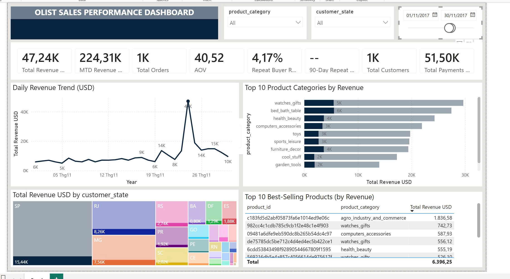
    *Figure 6: Sales Performance Dashboard filtered for November 2017, illustrating the dramatic revenue spike on Black Friday (Nov 24).*

*   **Seasonal Category Shifts:**
    *   *Example 1 (Christmas Shopping - Nov 2017):* **Watches & Gifts (watches_gifts)** rose to rank 1 (`30K USD`) and **Toys (toys)** reached rank 5 (`20K USD`), temporarily displacing the typical Health & Beauty category dominance.
    *   *Example 2 (World Cup Period - June-July 2018):* Analysis of the **Sports & Leisure (sports_leisure)** category during the 2018 FIFA World Cup (01/06/2018 - 31/07/2018) shows a clear impulse-buying pattern:
        - *Sales Share:* Sports & Leisure generated **`26.52K USD`** (5.8% of the platform's **`458.68K USD`** total) across **`790 orders`** (6.6% of the platform's **`12K`** total).
        - *AOV Drop:* The AOV for Sports & Leisure dropped to **`33.57 USD`**, which is **9.4% lower** than the platform average of **`37.06 USD`** during this period. This indicates that customers primarily bought lower-value fan gear (flags, t-shirts, etc.) rather than expensive athletic equipment. The best-selling item was the fan product `dd113cb02b2af9c8e5787e8f1f0722f6` making **`1,085.42 USD`**.
        - *Retention Dip:* The lifetime Repeat Buyer Rate for Sports & Leisure buyers was only **`2.53%`** (compared to the platform average of **`3.86%`** during the period), and the 90-day repeat rate was a mere **`0.25%`** (compared to the average **`0.58%`**). This confirms that World Cup purchases were situational, one-time events, with little to no customer retention after the tournament ended.

    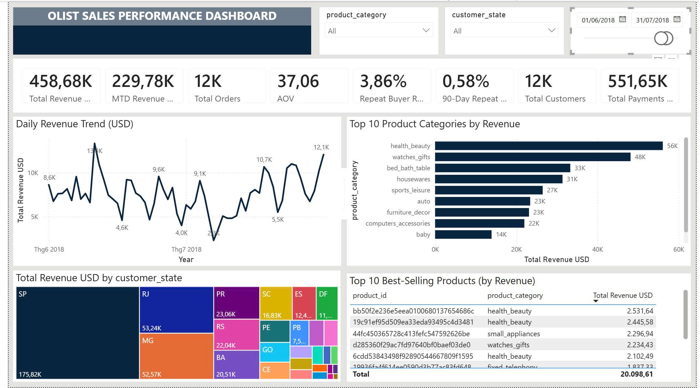
    *Figure 7: Sales Performance Dashboard filtered for Sports & Leisure category during the 2018 World Cup months (June-July).*

### 6.4. Data Engineering Design Highlights
*   **Push-down FX Conversion:** Performing currency conversion at the dbt layer allows Power BI to use a simple `SUM` aggregation, ensuring sub-second visual rendering on the dashboard.
*   **Late-Arriving Fallback (`pending_refresh`):** Using placeholder keys for late-arriving dimension records prevents fact ingestion failures during the day, while DAX measures filter them out to keep active customer counts clean.
*   **Decoupled Star Schema:** Splitting items and payments into separate Fact tables avoids duplicate row inflation (fan-out trap) and prevents circular reference errors in BI calculations.

    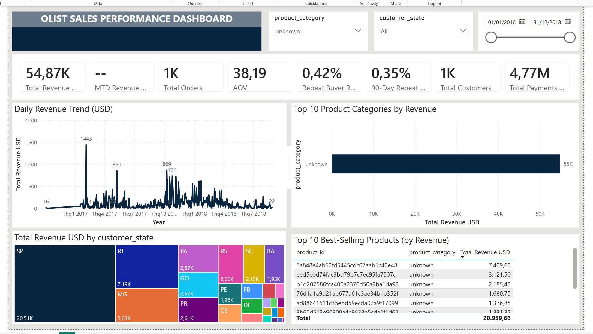
    *Figure 8: Sales Performance Dashboard demonstrating how product translation issues and orphan records are gracefully resolved to an 'Unknown' group to prevent revenue loss.*
