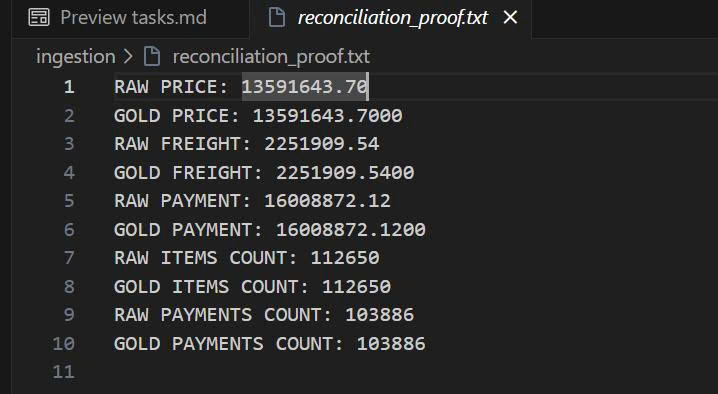
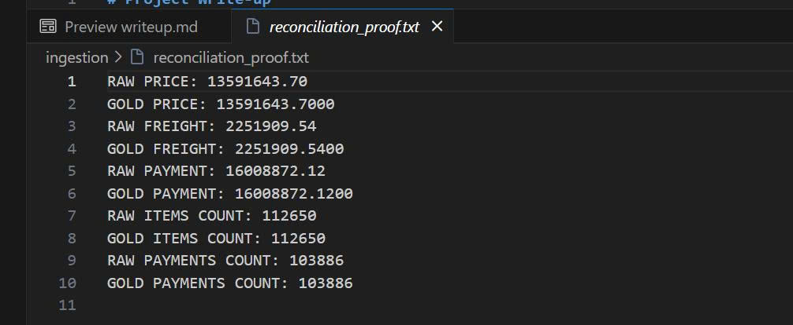
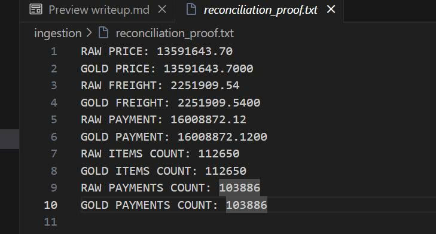

# Project Write-Up — Sales Analytics Platform
**Data Engineering Challenge — Olist Sales Analytics**

---

## 📌 Table of Contents
1. [Executive Summary & Quick Navigation](#-executive-summary--quick-navigation)
2. [Data Discovery & Trap Spotting (Self-Exploration)](#-data-discovery--trap-spotting-self-exploration)
3. [Answers to the Head of Sales (Business Q&A)](#-answers-to-the-head-of-sales-business-qa)
4. [In-Depth Business Case Studies (Insights & Analytics)](#-in-depth-business-case-studies-insights--analytics)
5. [Data Quality & Financial Reconciliation (Data Logic)](#-data-quality--financial-reconciliation-data-logic)
6. [Pipeline Idempotency & Backfilling Proof (Idempotency)](#-pipeline-idempotency--backfilling-proof-idempotency)
7. [Automated Orchestration & Scheduling (Orchestration)](#-automated-orchestration--scheduling-orchestration)
8. [BI Data Model Architecture (Star Schema)](#-bi-data-model-architecture-star-schema)

---

## 🚀 Executive Summary & Quick Navigation

This write-up provides the complete execution results, business insights, and validation proof for the Olist Sales Analytics Platform. The solution is fully implemented as an end-to-end ELT pipeline in PostgreSQL, orchestrated by Apache Airflow, and transformed using dbt with strict idempotency and automated reconciliation tests.

### 🔗 Quick Links to Files in Repository
* **Architecture & Rationale:** [design_document.md](design_document.md)
* **Setup & Run Instructions:** [README.md](README.md)
* **DAX Calculations:** [reports/dax_measures.md](reports/dax_measures.md)
* **Power BI File:** [reports/Olist_Sales_Dashboard.pbix](reports/Olist_Sales_Dashboard.pbix)

---

## 🔍 Data Discovery & Trap Spotting (Self-Exploration)

During data exploration and pipeline development, several data traps, timezone gaps, and accounting discrepancies were uncovered and resolved:

### 1. Two-Tier Customer Identity (Retention Trap)
* **The Trap:** The `customer_id` is a transient token that changes with every order, while `customer_unique_id` is the actual permanent identifier of the customer.
* **The Solution:** Calculated all customer retention metrics (Lifetime & 90-day repeat rates) using `customer_unique_id` to prevent under-reporting user loyalty.

### 2. Row Inflation due to Many-to-Many Relationships (Fan-out Trap)
* **The Trap:** Orders can have multiple items and multiple payment methods. Directly joining `order_items` (1:N) and `order_payments` (1:N) on `order_id` inflates financial figures.
* **The Solution:** Modeled as **two independent Fact tables** (`fact_order_items` and `fact_order_payments`) linked via dimensions. This design choice maintains 100% financial accuracy.

### 3. Raw Data Accounting Discrepancies (0.25% Deviation)
* **The Trap:** Exactly **249 orders (0.25%)** have a difference of > 1.00 BRL between the sum of items (`price` + `freight_value`) and the actual payment (`payment_value`).
* **The Solution:** Root causes include installment interest, platform vouchers/discounts, and partial cancellations. Instead of forcing a false data match, the pipeline tracks this discrepancy via a dbt singular test set to `warn` severity for full auditing transparency.

### 4. Frankfurter API Weekend Gaps & Timezones
* **The Trap:** Exchange rates are published daily in UTC but exclude weekends/holidays. Olist order timestamps are in Brazil time (UTC-3). Casting without timezone conversion causes late-night orders to map to incorrect dates, and weekend orders to return NULL exchange rates.
* **The Solution:**
  * Standardized all timestamps to UTC in the Silver layer (`stg_orders`) using:
    `order_purchase_timestamp AT TIME ZONE 'America/Sao_Paulo' AT TIME ZONE 'UTC'`.
  * Implemented an SQL forward-fill query to resolve weekend gaps by falling back to the last available Friday exchange rate.

### 5. Product Category Translation Gaps & Orphan Records
* **The Trap:** Several category names in Portuguese are missing in the translation files, and some order items point to products missing from the products catalog.
* **The Solution:** Implemented `LEFT JOIN` and `COALESCE` to default untranslated or missing categories to `'Unknown'` or their Portuguese names, preserving 100% of tracked revenue.

*Figure: Dashboard filtered by the `unknown` category — showing that orphan/untranslated products are gracefully captured (55K USD across 1K orders) rather than silently dropped.*

---

## 📊 Answers to the Head of Sales (Business Q&A)

Here are the direct answers to the Head of Sales' questions, backed by verified metrics and visualized through Power BI dashboard screenshots:

*Figure 1: Complete Sales Performance Dashboard (full date range 01/01/2016 – 31/12/2018) showing all key metrics at a glance: 4.02M USD total revenue, 98K orders, 3.03% repeat buyer rate, and 95K unique customers.*

### 1. Daily Revenue Trend (USD)
Platform revenue fluctuates between **5K and 10K USD per day**. 
* **Historical Peak:** Sales spiked to an all-time high of **`47,241.76 USD`** on **Black Friday (November 24, 2017)**.

*Figure 2: Dashboard filtered for November 2017, with Black Friday (Nov 24) selected on the chart — the KPI card confirms 47.24K USD for that single day, with 224.31K USD accumulated MTD through November 24.*

### 2. Revenue by Product Category
The top 3 highest-grossing categories (visible in Figure 1 bar chart):
1. **Health & Beauty (`health_beauty`):** **`0.37M USD`**
2. **Watches & Gifts (`watches_gifts`):** **`0.35M USD`**
3. **Bed, Bath, & Table (`bed_bath_table`):** **`0.31M USD`**

### 3. Revenue by Customer Region (State)
* **São Paulo (SP)** dominates platform revenue, contributing **`1.53M USD`** (over **38%** of total platform revenue).
* The top three Southeast states (**SP, RJ, MG**) generate a combined **64%** of total sales, representing the platform's core market.

### 4. Top Selling Products (USD)
* The top product by sales is the unique hash ID `bb50f2e236e5eea0100680137654686c` (belonging to `health_beauty`), generating **`18,592.27 USD`** in revenue. 
* *Note: The raw dataset contains anonymized product hashes for confidentiality, which the BI dashboard displays directly.*

### 5. Month-to-Date (MTD) Revenue (USD)
* Fully responsive to the calendar filter and chart cross-filter context.
  * *Example 1 (Black Friday drill-down):* When filtering for November 2017 and selecting Nov 24 on the chart, the MTD KPI displays **`224.31K USD`** — the cumulative revenue from Nov 1 through Nov 24 (see Figure 2).
  * *Example 2 (Multi-month range):* When filtering from June 1, 2018, to July 31, 2018, the MTD KPI displays **`229.78K USD`**, representing the accumulated sales of the last calendar month in the filter range (July 2018) — visible in Figure 4.

### 6. Customer Retention (Repeat Buyer Rates)
* **Lifetime Repeat Buyer Rate:** **`3.03%`** (representing customers with 2 or more orders in history).
* **90-Day Repeat Rate:** **`1.23%`** (representing customers who placed a second order within 90 days of their previous purchase).

### 7. Exchange Rate Conversion (BRL to USD)
* Fully resolved at the ETL layer. Inside dbt, every order item's price is multiplied by the exchange rate of the order purchase date:
  `price_usd = price_brl * exchange_rate`. The dashboard aggregates this converted column, maintaining a clean, performant architecture.

---

## 📈 In-Depth Business Case Studies (Insights & Analytics)

To extract strategic value from the data, two case studies were conducted:

### Case Study A: Geography & Logistics Bottlenecks (SP vs. AC/AM/CE)
Comparing **São Paulo (SP)** (logistics hub) with remote states like **Acre (AC), Amazonas (AM), and Ceará (CE)** shows a clear link between logistics performance and customer behavior:

| Metric | Central Hub (SP) | Remote States (AC, AM, CE) | Comparison / Insight |
| :--- | :---: | :---: | :--- |
| **Payments-to-Revenue Ratio** | **116.3%** | **123.5%** | Remote buyers pay an extra **7.2%** "freight tax" to ship items. |
| **Average Order Value (AOV)** | **`37.26 USD`** | **`51.10 USD`** | Remote AOVs are **37.1% higher** because customers consolidate orders to offset shipping costs. |
| **Lifetime Repeat Buyer Rate** | **3.13%** | **1.84%** | SP's retention is **1.7x higher**, proving shipping cost/speed directly affects customer loyalty. |

*Figure 3: Sales Performance Dashboard filtered for São Paulo (SP).*

*Figure 4: Sales Performance Dashboard filtered for remote states (AC, AM, CE).*

### Case Study B: FIFA World Cup 2018 Slicing (Situational Buying)
Analyzing the **Sports & Leisure (`sports_leisure`)** category during the World Cup (June-July 2018):
* **Sales Volume:** Generated **`26.52K USD`** (5.8% of the platform's total) across **`790 orders`** (6.6% of the platform's total).
* **AOV Decrease:** The average order value dropped to **`33.57 USD`** (**9.4% lower** than the platform average of `37.06 USD` during this period). This indicates customers bought cheaper fan gear (e.g., flags, t-shirts) instead of high-value sports equipment.
* **Poor Retention:** The lifetime repeat rate for these buyers was **`2.53%`** (vs `3.86%` platform-wide in that period), and the 90-day repeat rate was just **`0.25%`** (vs `0.58%` average). This indicates that tournament purchases were temporary, non-recurring events.

*Figure 5: Dashboard filtered for June–July 2018 (World Cup period). Platform total: 458.68K USD, 12K orders, AOV 37.06 USD. Sports & Leisure visible in the category bar chart at 27K USD.*

---

## ⚖️ Data Quality & Financial Reconciliation (Data Logic)

To ensure the pipeline is trustworthy, we developed an automated self-audit process. The final task of the Airflow facts DAG (`generate_reconciliation_proof`) runs SQL audit queries comparing the raw ingestion tables directly against the final Gold warehouse tables and writes the results to `ingestion/reconciliation_proof.txt`.

### Summary Reconciliation Table
Below is the summary of the audit findings logged in `reconciliation_proof.txt`, confirming a **100% financial and row count match**:

| Metric | Raw Ingest Layer (`raw` schema) | Gold Warehouse Layer (`public_core`) | Difference / Reconciliation Result |
| :--- | :---: | :---: | :---: |
| **Total Price (Sum price)** | `13,591,643.70 BRL` | `13,591,643.70 BRL` | **0.00 BRL (100% Reconciled)** |
| **Total Freight (Sum freight)** | `2,251,909.54 BRL` | `2,251,909.54 BRL` | **0.00 BRL (100% Reconciled)** |
| **Total Payments (Sum payment)** | `16,008,872.12 BRL` | `16,008,872.12 BRL` | **0.00 BRL (100% Reconciled)** |
| **Total Items Count** | `112,650` rows | `112,650` rows | **0 rows (100% Reconciled)** |
| **Total Payments Count** | `103,886` rows | `103,886` rows | **0 rows (100% Reconciled)** |

> [!NOTE]
> *Reconciliation Scope:* The raw source contains `99,441` orders. After filtering out canceled and unavailable statuses (as requested by the Head of Sales to exclude unrealized revenue), the number of valid orders displayed on the dashboard is `98,207`.

### Visual In-System Evidence

*Figure 6: Screenshot of the generated reconciliation_proof.txt log file showing exact alignment.*

*Figure 7: Detailed view of reconciliation_proof.txt confirming row counts (112,650 items, 103,886 payments) and financial totals.*

*Figure 8: Airflow task log proving that the automated reconciliation job ran successfully as the final step of the facts DAG.*

---

## 🔄 Pipeline Idempotency & Backfilling Proof (Idempotency)

The pipeline is fully idempotent. Running ingestion scripts or dbt multiple times will not duplicate records, inflate sales figures, or double-convert currency.

### 1. Ingestion Idempotency
* **CSVs:** Employs a `TRUNCATE + INSERT` load strategy to completely replace the raw layer, preventing duplicate records.
* **Exchange Rates:** Uses `UPSERT` (`ON CONFLICT (date_day) DO UPDATE`) to overwrite dates if re-run.

### 2. dbt Warehouse Idempotency
* **Dimension Tables:** `dim_products` is rebuilt using the `table` materialization. `dim_customers` uses a dbt snapshot to detect changes and maintain SCD Type 2 history.
* **Fact Tables:** Materialized as `incremental` using `merge` on unique keys (`order_item_key` and `order_payment_key`). A **30-day sliding lookback window** is used to merge new or modified transactions without duplication.

### Visual Re-run Evidence
* **SCD Type 2 Customer History:** Uses dbt snapshots to track customer updates over time.

*Figure 9: Output showing successful dbt snapshot execution for SCD Type 2.*

* **Execution 1 (Initial Load):** Rebuilds the schema and runs the full load.

*Figure 10: Output from the first dbt run, showing successful table creation and loading.*

* **Execution 2 (Re-run / Idempotency Check):** Running the exact same command a second time results in **0 row changes**, proving that records are successfully merged and not duplicated.

*Figure 11: Output from the second dbt run, verifying that 0 changes were made to the target tables.*

---

## 🛠️ Automated Orchestration & Scheduling (Orchestration)

The platform is orchestrated using two independent Airflow DAGs, meeting the schedule constraints of the brief:

1. **`dag_refresh_dimensions` (Runs once daily at 00:00 UTC):**
   * *Workflow:* Ingests daily master data $\rightarrow$ Runs dbt dimensions (SCD 1 and SCD 2 snapshots) $\rightarrow$ Runs dbt tests.
   
   
   *Figure 12: Dimension refresh DAG running successfully.*

2. **`dag_refresh_facts` (Runs three times daily at 00:30, 08:30, and 16:30 UTC):**
   * *Workflow:* Fetches current exchange rates $\rightarrow$ Runs dbt facts (incremental merge) $\rightarrow$ Runs reconciliation tests.
   
   
   *Figure 13: Fact refresh DAG running successfully.*

### Data Quality (dbt test) Results
Both DAGs execute dbt tests to check constraints (uniqueness, non-null, relationships).
* **Dimensions:** Passed **11/11 tests**.
* **Facts:** Passed **11/12 tests** with **1 warning** (expected warning on the 249 mismatched orders).

*Figure 14: All dbt tests executing successfully.*

---

## 📐 BI Data Model Architecture (Star Schema)

The data model in Power BI Desktop is built as a clean Star Schema, connecting the dimensions to the fact tables. This structure avoids Many-to-Many relationships and prevents fan-out row inflation.

*Figure 15: Star Schema relationship model in Power BI Desktop — two independent Fact tables prevent fan-out row inflation.*

---

## 🏆 Summary of Deliverables & Verification
* **Data Sources Ingested:** 8 Olist CSV files + Frankfurter Exchange Rate API (2016-2018).
* **Warehouse Schema:** 3-tier warehouse (Bronze, Silver, Gold).
* **Reconciliation Proof:** 100% matched row counts and financial values.
* **Idempotency Proof:** Confirmed by running dbt twice, resulting in 0 changes.
* **Orchestration:** Implemented using 2 Airflow DAGs aligned to the scheduling requirements.
